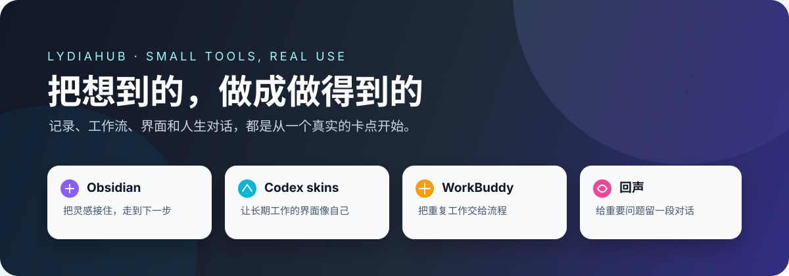

# Lydiahub

 

> **我把工作里那些容易丢掉的想法、重复做的事情，做成可以真正用起来的小工具。**
>
> *不是为了堆更多功能，而是让下一步变得更容易。*

[开始使用](GETTING-STARTED.md) · [我在做什么](#我在做什么) · [为什么做](#为什么做) · [获取与交流](#获取与交流)

---

## 从这里开始

如果你是从视频过来的，不用先研究一堆介绍：

1. 按你的问题挑一个产品；
2. 打开[上手页](GETTING-STARTED.md)，先看适用场景和安装方式；
3. 到[爱发电领取与更新入口](https://afdian.com/a/lydiahub2026)获取当前版本。

基础版本免费分享。遇到问题可以提 Issue，也可以在抖音主页群聊里交流；需要定制、部署适配或长期维护，再单独联系。

<table>
<tr>
<td colspan="4"><b>每个字都认识，连起来却不知道对方要什么</b> → <a href="products/shuorenhua/README.md">说人话 · 先听懂，再回对话</a></td>
</tr>
<tr>
<td width="25%"><b>想法总是记不住</b> → Obsidian 工作流</td>
<td width="25%"><b>Codex 看腻了原生界面</b> → 皮肤与管理工具</td>
<td width="25%"><b>重复运营工作太多</b> → WorkBuddy 数字员工</td>
<td width="25%"><b>有些问题想继续想</b> → 回声 APP</td>
</tr>
</table>

---

## 我在做什么

### 说人话 · 先听懂，再回对话

“围绕用户价值找抓手，尽快形成闭环。”每个字都认识，可真正难的是：先做哪件，做到什么程度，怎么回才不显得没听懂。

[说人话](products/shuorenhua/README.md)把原话和场景规则交给你已经在用的豆包、钉钉 AI、WorkBuddy 或 ChatGPT：先翻成人话、找出最该确认的坑，再把你的意思改成对方听得进去的回复。领导、客户、同事、女朋友，换一个场景，判断重点和说法也会跟着换。

它不接模型 API，也不要求你再养一个 AI 账号；能用“好的，收到”解决的事，就直接回复，不浪费一次 AI。

### Obsidian 工作流 · 让记录继续走下去

灵感往往不是没有出现过，而是出现的时候，手边没有一个足够顺手的入口。

这个工具把待办和灵感先接住，保存成 Markdown，再和 Obsidian、Codex 联动整理。记录不再停在“我想过”，而是能继续走到“我准备做什么”。

### Codex 皮肤与管理工具 · 让工作界面更像自己的

我做了 100 多款 Codex 皮肤，也做了一个可以搜索、预览、一键安装、切换和恢复的管理工具。你可以直接使用，也可以按自己的习惯制作新的皮肤。

皮肤不是为了炫技。每天要面对几个小时的工作界面，颜色、节奏和熟悉感，确实会影响一个人愿不愿意继续做下去。

### WorkBuddy 数字员工工作台 · 把重复工作交给流程

很多工作并不难，只是每天都要从头来一遍：找资料、列选题、改格式、做检查、再把结果交接出去。

数字员工工作台把这些重复步骤拆成可执行的工作流，让人把时间留给判断、创意和真正需要负责的决定。

### 回声 APP · 给重要的问题留一段可以回来的对话

有些问题当下没有答案，但值得被认真留下来。

回声围绕人生阶段、选择和关系做记录与对话。它不替你下结论，只帮你把模糊的感受说清楚；等你走到下一段路，还能回来看看当时的自己。

---

## 为什么做

我不太想再做一个“功能很多，但打开以后不知道先点哪里”的产品。

我更在意三件小事：

- 突然想到的东西，能不能在十秒内留下来；
- 别人说了一大段，能不能不靠猜就弄清下一步；
- 重复做过很多次的工作，能不能交给一套可靠的流程；
- 一个人在长期使用工具时，能不能感觉到它真的在帮自己。

这些产品都来自真实使用中的卡点。先做出能用的版本，再让使用的人告诉我哪里还不顺。

## 获取与交流

- [工具领取与更新入口（爱发电）](https://afdian.com/a/lydiahub2026)
- 使用问题、建议和 Bug，欢迎在对应仓库提交 Issue
- 微信：`lydiahub2026`

个人使用版和基础工具会免费分享。企业或团队如果需要定制功能、部署适配、数据迁移或长期维护，再单独沟通。

## 我相信

**好工具不是替你生活，而是帮你少丢掉一点想法，少重复一点消耗，多留一点力气给真正重要的事。**

我会继续把遇到的问题做成小而完整的产品，把能公开分享的部分免费放出来。
