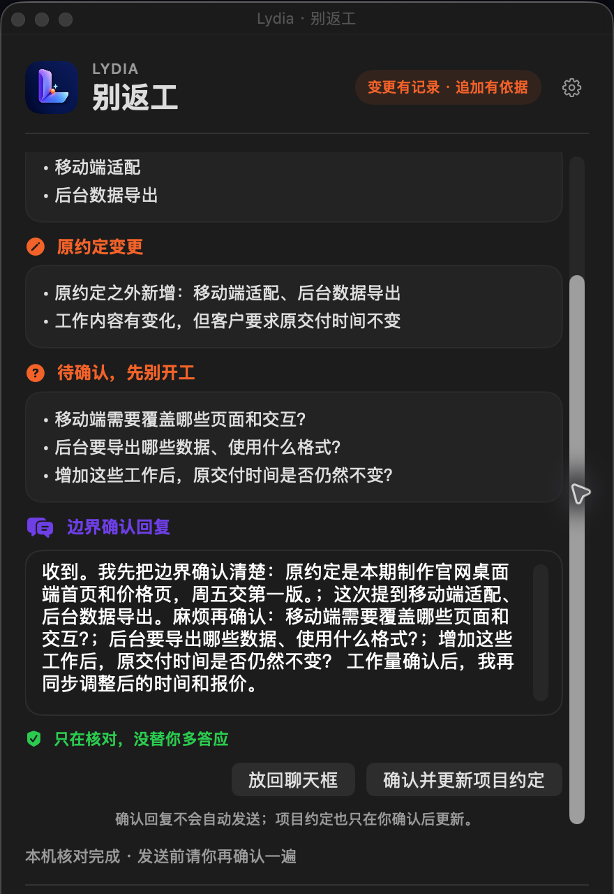

# Lydiahub

> **我把真实工作里那些“明明可以少受一遍罪”的卡点，做成真能用起来的小工具。**
>
> 先解决一件具体的事，再根据真实反馈继续迭代。

[按问题找工具](#按你现在卡住的事来选) · [下载与内测](#下载与内测) · [最近更新](#最近更新)

---

## 按你现在卡住的事来选

| 你现在正烦什么 | 工具 | 它能帮你得到什么 | 当前状态 |
| --- | --- | --- | --- |
| 对方说了一大段，每个字都认识，还是不知道到底要我干什么 | [说人话](https://github.com/lydiahub19921013/shuorenhua) | 拆出行动和确认点，再按你的真实意思写成能发的回复 | macOS v0.9.0，可下载 |
| 客户一句“顺便改一下”，做着做着就说不清到底多了多少活 | [别返工](products/biefangong/README.md) | 对照已经说定的范围，挑出新增、变更和没说清的地方 | macOS v0.1.0，招募内测 |
| 灵感和待办总在切换应用时丢掉 | [桌面流转台](https://afdian.com/album/1f24622aa83511f184a452540025c377) | 先在桌面接住，再保存为 Markdown，按需连接 Obsidian / Codex | macOS v1.0.0；Windows v1.0.3 |
| 每天盯着 Codex 原生界面，想换成更像自己的工作台 | [Codex 皮肤工坊](https://afdian.com/album/26288eaca83511f19cc352540025c377) | 搜索、预览、安装、切换和恢复皮肤 | macOS，免费领取 |
| 每次做选题都要重新找资料、筛方向、整理结果 | [小燃选题员工](https://afdian.com/a/lydiahub2026) | 把重复的选题步骤交给固定流程，留下真正需要人判断的部分 | 正式版 |

第一次来，可以直接打开[上手页](GETTING-STARTED.md)。不用先研究技术名词，按自己正在卡住的事选一个就行。

---

## 这轮正在重点做的两个产品

### 说人话 · 先听懂，再按你的意思回

“围绕用户价值找抓手，尽快形成闭环。”每个字都认识，可真正难的是：先做哪件，做到什么程度，怎么回才不显得没听懂。

「说人话」会把原话拆成真正要做的事和最该确认的坑，再按照你本人的意思组织回复。生成内容如果偷偷多答应了时间、范围、责任或保证，会先拦住；草稿只放回聊天输入框，由你确认后发送。

**[查看产品与下载 v0.9.0](https://github.com/lydiahub19921013/shuorenhua)**

### 别返工 · 先把这次到底多做什么说清楚

客户嘴里可能只是“移动端也顺便做一下”，落到接单者这里，却是页面、接口、测试和交付时间一起变化。

「别返工」会保存每个项目当前已经确认的约定。客户再发新消息时，把整段贴进去，它会挑出后来加的、原约定变了的、还不能直接开工的内容，并写出一段不吵架、也不先答应的确认回复。

**[查看产品边界与内测状态](products/biefangong/README.md)**

---

## 其他正在持续维护的方向

- **桌面流转台**：把一闪而过的待办和灵感留在桌面，再按需进入 Obsidian、Codex 或复盘流程。
- **Codex 皮肤工坊**：让长期使用的工作界面更舒服，也保留一键恢复原状的安全出口。
- **WorkBuddy 数字员工工作台**：把找资料、列选题、改格式、做检查等重复步骤变成可执行流程。
- **回声 APP**：给人生阶段、选择和关系留一段以后还能回来的对话。
- **一人公司 AI 成本副驾驶**：在选模型和搭流程前，先看清调用成本会花在哪里。

没有公开下载的项目会明确写成“开发中”或“内测中”，不会拿本地构建冒充正式发布。

## 我做产品时守的边界

- **先有真实任务**：不是先堆功能，再找一个听起来合理的用途。
- **尽量本地保存**：能留在用户电脑里的项目、约定和记录，不默认上传。
- **关键动作由人确认**：回复不自动发送，项目范围不在用户确认前更新。
- **状态说实话**：测试通过、真实设备验证、签名、公证和正式发布是不同层级，分别说明。

## 下载与内测

- [GitHub：说人话最新版](https://github.com/lydiahub19921013/shuorenhua/releases/latest)
- [爱发电：工具领取与更新入口](https://afdian.com/a/lydiahub2026)
- [飞书：Lydiahub 免费产品领取中心](https://jcnrbes3t04e.feishu.cn/drive/folder/VRnafPFVDlcNXrdtpSwcWaWFnEj)
- Bug 和功能建议：在对应公开仓库提交 Issue
- 内测、定制和长期维护：微信 `lydiahub2026`

基础工具会继续免费分享。企业或团队需要定制功能、部署适配、数据迁移或长期维护时，再单独沟通。

## 最近更新

- **2026-09-08**：「别返工」完成 v0.1.0 内测候选版，真实识别新增工作、原约定变化和待确认问题。
- **2026-09-07**：「说人话」发布 v0.9.0，可从 GitHub Releases 下载。
- **2026-09-04**：桌面流转台更新为 Windows v1.0.3，并在 Windows 10、11 完成核心路径验证；Mac 使用 v1.0.0 DMG。
- **2026-09-04**：爱发电首页改为先展示桌面流转台、Codex 皮肤工坊和综合产品入口。

---

**好工具不是替你生活，而是帮你少猜一点、少返工一点，把力气留给真正需要你决定的事。**
