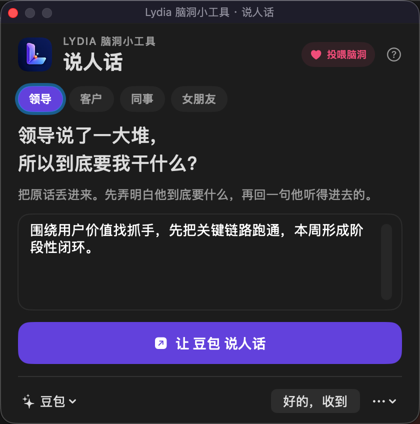

# Lydia 脑洞小工具 · 说人话

领导说了一大堆，所以到底要我干什么？



这是一个 macOS 小工具，不是另一个 AI。它把工作和生活里那些“每个字都认识，连起来却听不懂”的话，连同已经设计好的“听懂—确认—回复”规则，一起交给用户本来就在用的豆包、钉钉 AI、WorkBuddy 或 ChatGPT。

## 首版场景

- 领导：到底要我干什么？
- 客户：绕了半天到底想要什么？
- 同事：到底想让我配合什么？
- 女朋友：所以我到底哪儿错了？

点击标题上方的场景标签即可切换。场景不只改变文案，也会改变 AI 判断的重点。

## 它不只翻译

普通翻译只能告诉你“他说了什么”。真正容易返工的是另外两件事：他没有说清什么，以及你该怎样回复。

“说人话”把这三步放在同一次对话里：

1. **说白了**：把抽象表达翻成可以行动的话；
2. **最该确认**：指出任务、边界、完成标准里最容易踩坑的一处；
3. **按我的意思回**：先听你的真实意图，再改成对方听得进去、可以直接发送的表达。

## 最短路径

1. 复制整段消息，按 `Control + Option + R`；支持标准文本选择的软件，也可以右键选择“服务 → 说人话”。
2. 选择场景，再点“让豆包说人话”。工具会复制带好规则的任务，并打开已选择的平台。
3. 在平台里粘贴发送。AI 先把原话说明白，再问用户真正想怎么回，最后只给一条能直接发送的表达。

底部的“好的，收到”等固定回复不调用 AI；能确认原聊天输入框时直接发送，否则只复制。

右上角“投喂脑洞”会打开 Lydia 的爱发电主页，主功能不受赞助影响。

## 下载 v0.8.0

- [爱发电产品页](https://afdian.com/album/0f65cecea93d11f1a1e15254001e7c00)
- [飞书备用下载目录](https://jcnrbes3t04e.feishu.cn/drive/folder/NXANfZikNlmzohdKTQBcnv8bnAf)

个人使用版免费。GitHub 保存可审查的源码、测试和构建说明；普通用户无需自己编译。

## 产品边界

- 不接模型 API，不要求用户再养一个 AI 账号。
- 不自动拿回 AI 结果，因此翻译流程不再要求辅助功能权限。
- 飞书或钉钉内置 AI 的开通范围、免费额度和付费规则，由对应平台与企业管理员决定。
- 工具不保存聊天，也不后台扫描剪贴板；只有用户主动打开或调用系统服务时才读取当前文字。

## 本地构建

```bash
./scripts/test.sh
./scripts/build.sh
open build/v0.8.0/说人话.app
```

当前构建面向 Apple Silicon、macOS 13 及以上。

## 目录

- `Sources/`：SwiftUI 桌面工具源码
- `Tests/`：场景提示词、交接协议和回复目标判断测试
- `Resources/`：Lydia Logo 与应用图标
- `scripts/test.sh`：运行 52 项核心检查
- `scripts/build.sh`：构建并校验本地签名的 macOS App
- `docs/`：调研证据与产品取舍记录

## 隐私

工具不保存聊天、不后台扫描剪贴板，也不上传文字到 Lydia 的服务器。文字只会在你主动操作时，被复制并交给你选择的 AI 平台；后续数据如何处理，以对应平台的规则为准。
